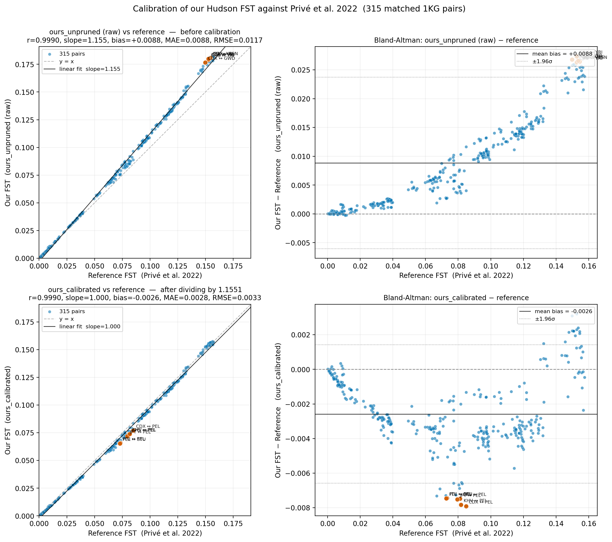
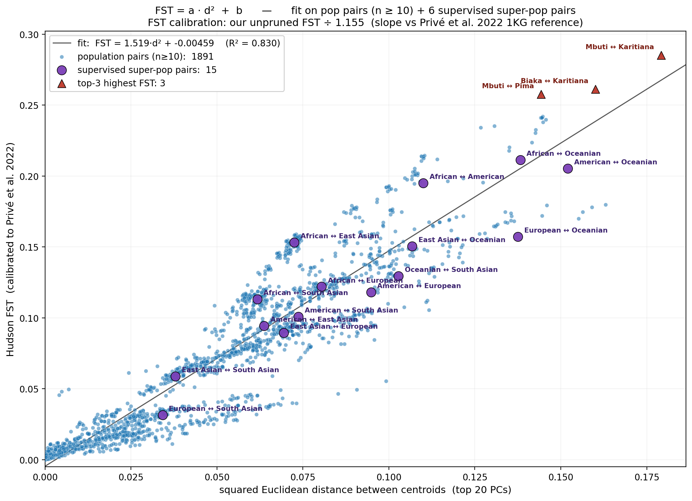
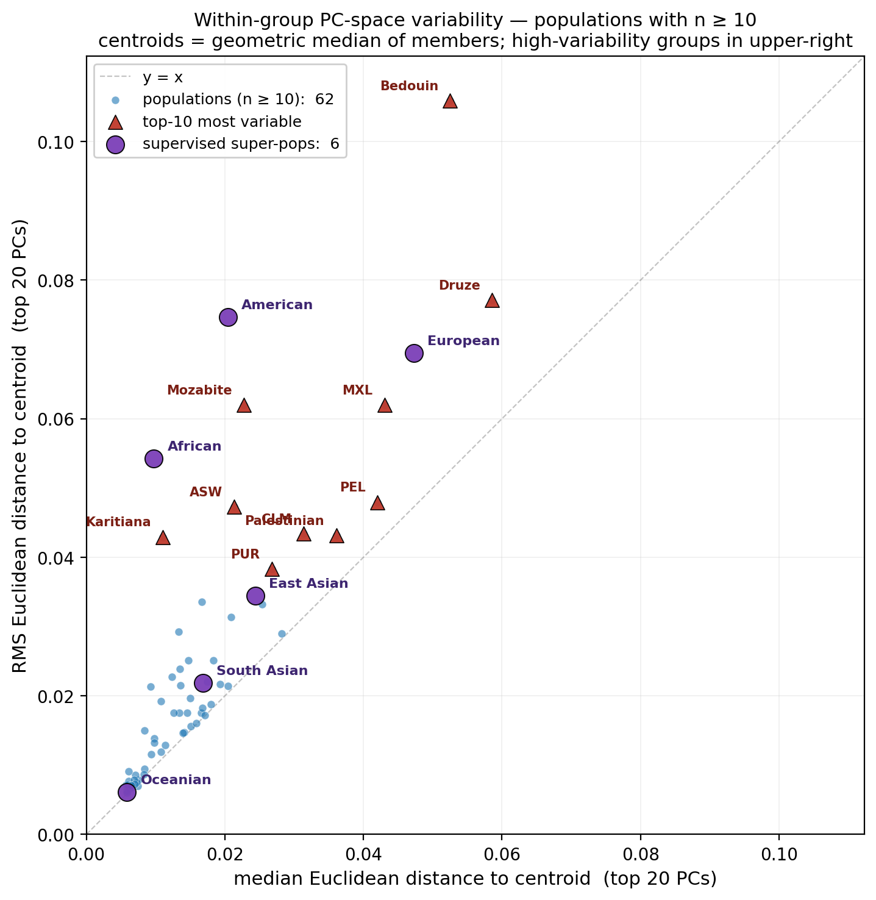
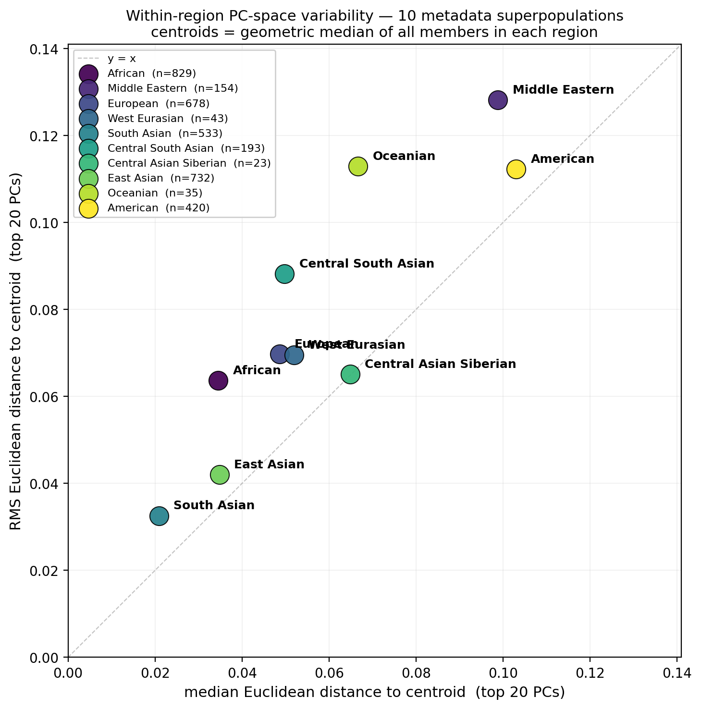

# Public Statistical Genetics Pipeline

A fully reproducible bioinformatics pipeline for harmonizing, aligning, and performing rigorous quality control on the 1000 Genomes (KG), Human Genome Diversity Project (HGDP), Simons Genome Diversity Project (SGDP), and Genome in a Bottle (GIAB) Ashkenazi Jewish reference panels, followed by supervised ADMIXTURE ancestry estimation. The pipeline merges four major human genetic diversity datasets into a single reference panel of 4,324 samples, runs supervised ADMIXTURE with cross-validation, and produces continental ancestry fractions, structure plots, and estimated allele frequencies — all from a single `bash main.sh` command.

## Quick Start — Docker (recommended)

Pull the pre-built image and run with defaults (K=6, MAF=1%):

```bash
docker pull ghcr.io/jesseicr/public-statgen:latest
docker run --rm -v $(pwd)/statgen-data:/app/pipeline-output ghcr.io/jesseicr/public-statgen:latest
```

Override parameters with environment variables:

```bash
docker run --rm \
  -e K_MODEL=3 \
  -e MAF_ADMIXTURE=0.0200 \
  -v $(pwd)/statgen-data:/app/pipeline-output \
  ghcr.io/jesseicr/public-statgen:latest
```

| Variable | Description | Default |
|----------|-------------|---------|
| `K_MODEL` | ADMIXTURE K model (3, 5, or 6) | `6` |
| `MAF_ADMIXTURE` | Minor allele frequency threshold (decimal) | `0.0100` |

Results are written to the mounted volume. The pipeline needs approximately **91 GB peak disk space** during execution and **~15 GB** for final outputs.

### Build locally

```bash
docker build -t public-statgen .
docker run --rm -v $(pwd)/statgen-data:/app/pipeline-output public-statgen
```

## Quick Start — Local (no Docker)

```bash
bash main.sh
```

The pipeline will prompt for two configuration choices:

1. **ADMIXTURE K model** — K=3, K=5, or K=6 (default: K=6)
2. **MAF threshold** — minor allele frequency percentage for ADMIXTURE QC (default: 1%)

After that it runs unattended. The pipeline is idempotent — re-running skips any steps that have already completed.

You can also skip the interactive prompts by setting environment variables:

```bash
K_MODEL=6 MAF_ADMIXTURE=0.0100 bash main.sh
```

A separate orchestrator `pca.sh` runs principal component analysis, pairwise Hudson Fst, and PC-space variability analyses on the same merged panel:

```bash
bash pca.sh
```

This produces calibrated Fst values, a predictive Fst↔PC-distance equation, and within-group variability statistics — see [PCA + Fst Pipeline](#pca--fst-pipeline-pcash) below.

## Requirements

### Docker

- **Docker** (any platform with x86_64 support)

All tools and dependencies are bundled in the image — nothing else to install.

### Local

- **Python 3** (for SGDP QC; a venv is created automatically)
- **curl** (for downloading data and tools)
- macOS (Intel or Apple Silicon), Linux (x86_64), or Windows via WSL

PLINK 1.9, PLINK 2.0, UCSC liftOver, and ADMIXTURE are installed automatically by the pipeline.
Python dependencies (`pandas`, `numpy`, `matplotlib`) are installed into a local venv.

## Pipeline Overview

`main.sh` is the top-level orchestrator. It runs each stage in order and exports shared paths (`DOWNLOADS_DIR`, `QC_DIR`, `MERGE_DIR`, `PLINK1`, `PLINK2`, `LIFTOVER`, `CHAIN_FILE`, `PYTHON`, `SNPS_FILE`, `PLINK_MEMORY`, `PLINK_THREADS`, `SUPERVISED_ADMIXTURE`, `ADMIXTURE`) so that all downstream scripts use consistent locations.

### Stages

| Stage | Script | Description |
|-------|--------|-------------|
| 1 | `setup_plink.sh`, `setup_liftover.sh` | Downloads and installs PLINK 1.9, PLINK 2.0, and UCSC liftOver into `tools/bin/` |
| 2 | `download_files.sh` | Downloads KG, HGDP, SGDP, Neural ADMIXTURE, and GIAB files into `downloads/` |
| 3 | `qc_kg_hgdp.sh` | Decompress, filter (autosomal, biallelic, SNP extract, remove KG relatives), and convert to bed/bim/fam in `qc/` |
| 4 | `setup_python.sh` | Creates a Python venv in `tools/venv/` and installs dependencies from `requirements.txt` |
| 5 | `qc_sgdp.py` | Lifts SGDP from hg19 to hg38 using UCSC liftOver, matches to KG by (chrom, pos, alleles), assigns rsIDs, outputs `qc/sgdp_qc.{bed,bim,fam}` |
| 6 | `merge_kg_hgdp_sgdp.sh` | Aligns alleles, merges KG+HGDP, deduplicates SGDP samples, three-way merge, removes ambiguous SNPs, applies geno filter |
| 7 | `prepare_giab.py` + `merge_giab.sh` | Converts GIAB Ashkenazi parent VCFs to PLINK (filling hom-ref from high-confidence BED), merges into reference panel, normalizes fam |
| 8 | `build_metadata.py` | Merges KG, HGDP, SGDP, GIAB metadata with Neural ADMIXTURE ancestry labels into `summary/metadata.csv` |
| 9 | `build_supervised.py` | Assigns samples to K=6 supervised ADMIXTURE reference populations, writes `summary/supervised.csv` |
| 10 | `setup_admixture.sh` | Downloads and installs ADMIXTURE into `tools/bin/` |
| 11 | `qc_admixture.sh` | QC on supervised samples only: geno, MAF, long-range LD exclusion, LD pruning, mind, kinship, HWE (on unrelated). Applies resulting SNP list to all samples for projection. |
| 12 | `run_admixture_supervised.py` | 3-fold stratified cross-validation + final supervised ADMIXTURE run (K=6) |
| 13 | `analyze_admixture_results.py` | Structure plots, cross-validation accuracy, augmented metadata with ancestry fractions, formatted allele frequency file |

## Directory Structure

```
public-statgen/
├── main.sh                      # Run this
├── setup_plink.sh               # Stage 1: install PLINK
├── setup_liftover.sh            # Stage 1: install UCSC liftOver
├── download_files.sh            # Stage 2: download reference panels + GIAB + neural data
├── qc_kg_hgdp.sh               # Stage 3: QC KG and HGDP
├── setup_python.sh              # Stage 4: set up Python venv
├── qc_sgdp.py                   # Stage 5: QC SGDP (UCSC liftOver + rsID match)
├── merge_kg_hgdp_sgdp.sh       # Stage 6: three-way merge
├── prepare_giab.py              # Stage 7a: convert GIAB VCFs to PLINK
├── merge_giab.sh                # Stage 7b: merge GIAB into reference panel
├── build_metadata.py            # Stage 8: merge metadata + neural ancestry
├── build_supervised.py          # Stage 9: supervised ADMIXTURE reference populations
├── setup_admixture.sh           # Stage 10: install ADMIXTURE
├── qc_admixture.sh              # Stage 11: QC for ADMIXTURE
├── run_admixture_supervised.py  # Stage 12: run ADMIXTURE supervised
├── analyze_admixture_results.py # Stage 13: analyze ADMIXTURE output
├── requirements.txt             # Python dependencies
├── rsids_dense_chr1_22.txt      # SNP list for filtering
├── tools/
│   ├── bin/                     # Binaries (created by setup scripts)
│   │   ├── plink1
│   │   ├── plink2
│   │   ├── liftOver
│   │   └── admixture
│   └── venv/                    # Python venv (created by setup_python.sh)
├── downloads/                   # Raw downloaded data (created by main.sh)
│   ├── kg_all.{pgen.zst,pvar.zst,psam}
│   ├── deg2_hg38.king.cutoff.out.id
│   ├── hgdp_all.{pgen.zst,pvar.zst,psam}
│   ├── sgdp_all.{bed,bim.zip,fam}
│   ├── sgdp_metadata.txt
│   ├── hg19ToHg38.over.chain.gz # UCSC liftOver chain file
│   ├── neural/                  # Neural ADMIXTURE pretrained data
│   └── giab/                    # GIAB Ashkenazi parents (VCFs + BEDs)
│       ├── HG003_GRCh38_1_22_v4.2.1_benchmark.vcf.gz
│       ├── HG003_GRCh38_1_22_v4.2.1_benchmark_noinconsistent.bed
│       ├── HG004_GRCh38_1_22_v4.2.1_benchmark.vcf.gz
│       └── HG004_GRCh38_1_22_v4.2.1_benchmark_noinconsistent.bed
├── qc/                          # QC'd bed/bim/fam
│   ├── kg_qc.{bed,bim,fam}
│   ├── hgdp_qc.{bed,bim,fam}
│   └── sgdp_qc.{bed,bim,fam}
├── merge/                       # Merged fileset (KG + HGDP + SGDP + GIAB)
│   └── merged_kg_hgdp_sgdp.{bed,bim,fam}
├── supervised_admixture/        # ADMIXTURE working directory
│   ├── ancestry_qc.{bed,bim,fam}
│   ├── fold_assignments.csv
│   ├── admixture_fold{1,2,3}.K.Q
│   ├── admixture_final.K.{Q,P}
│   └── scrap/                   # Intermediate QC files
├── summary/                     # Final outputs
│   ├── metadata.csv
│   ├── supervised.csv
│   ├── koenig_harmonized_outliers_2024.txt
│   └── admixture-global-K/
│       ├── metadata_ancestry.csv
│       ├── structure_holdout.png
│       ├── structure_projected.png
│       └── admixture_allele_freqs.tsv
├── outputs/                     # Git-tracked deterministic outputs
│   └── admixture-global-6/
│       ├── metadata_ancestry.csv
│       ├── structure_holdout.png
│       ├── structure_projected.png
│       └── admixture_allele_freqs.tsv
└── literature_reference/        # Sample-level info extracted from publications
```

## Runtime and Storage

**Benchmarked on:** 128 cores, 503 GiB RAM | PLINK threads: 6, PLINK memory: 14 GB

### Per-Step Runtime

| Step | Description | Runtime |
|------|-------------|---------|
| 1 | Install PLINK (1.9 + 2.0) and UCSC liftOver | 2 s |
| 2 | Download KG, HGDP, SGDP, Neural ADMIXTURE, GIAB | ~7 m 30 s |
| 3 | QC KG and HGDP (decompress zst, filter, convert) | 9 m 49 s |
| 4 | Set up Python venv + dependencies | 11 s |
| 5 | QC SGDP (UCSC liftOver hg19 → hg38, filter) | 1 m 38 s |
| 6 | Merge KG + HGDP + SGDP | 16 s |
| 7 | Prepare and merge GIAB Ashkenazi parents | 16 s |
| 8 | Build metadata CSV | < 1 s |
| 9 | Build supervised reference populations | < 1 s |
| 10 | Install ADMIXTURE | < 1 s |
| 11 | QC for ADMIXTURE (geno, MAF, HWE, LD prune, kinship) | 4 s |
| 12 | Run ADMIXTURE supervised (3-fold CV + final, K=6) | 70 m 15 s |
| 13 | Analyze ADMIXTURE results (CV stats, plots, metadata) | 16 s |

**Total pipeline runtime: ~90 minutes.**

The two dominant steps are Step 3 (QC KG + HGDP, ~10 min) and Step 12 (ADMIXTURE runs, ~70 min), which together account for ~89% of total runtime. Step 12 runs ADMIXTURE 4 times (3 CV folds + 1 final), each taking ~17–19 min wall time using 6 threads.

### Storage

| Directory | Size | Contents |
|-----------|------|----------|
| `downloads/` | 13 GB | Raw downloaded files (KG, HGDP pgen.zst, SGDP bed, Neural ADMIXTURE, GIAB VCFs) |
| `tools/` | 306 MB | PLINK 1.9 + 2.0, UCSC liftOver, ADMIXTURE, Python venv |
| `qc/` | 496 MB | QC'd BED/BIM/FAM for KG, HGDP, SGDP |
| `merge/` | 389 MB | Merged three-dataset BED/BIM/FAM |
| `supervised_admixture/` | 858 MB | ADMIXTURE QC panel, fold .Q/.P files, final .Q/.P |
| `summary/` | 7.5 MB | metadata, supervised CSV, structure plots, allele freqs |
| **Total** | **~15 GB** | |

**Peak transient storage:** Step 3 decompresses KG and HGDP pgen.zst files (~5 GB each → ~8.9 GB uncompressed). Peak project size during step 3 is approximately **91 GB** before intermediates are removed.

The `downloads/` directory can be deleted after QC (steps 3 + 5) to reclaim ~13 GB, reducing the final footprint to ~2 GB.

## Data Sources

- **1000 Genomes (KG)** — hg38 pfiles from the [PLINK 2.0 resources page](https://www.cog-genomics.org/plink/2.0/resources)
- **HGDP** — hg38 pfiles (statistically phased) from the same source
- **SGDP** — hg19 bed/bim/fam from the [Reich Lab](https://reichdata.hms.harvard.edu/pub/datasets/sgdp/)
- **GIAB Ashkenazi Jewish trio** — hg38 benchmark VCFs from [NIST GIAB](https://ftp-trace.ncbi.nlm.nih.gov/ReferenceSamples/giab/release/AshkenazimTrio/) (parents HG003 and HG004 only)
- **Neural ADMIXTURE** — pretrained ancestry model from [Figshare](https://doi.org/10.6084/m9.figshare.19387538.v1)

## GIAB Integration

The GIAB Ashkenazi Jewish parents (HG003 = father, HG004 = mother) are included as non-supervised samples for ancestry projection. They are not used in ADMIXTURE training — their ancestry fractions are estimated by the trained model.

Because GIAB benchmark VCFs only contain variant calls (not homozygous-reference sites), `prepare_giab.py` uses the high-confidence BED files to fill in reference-homozygous genotypes at panel SNP positions that fall within callable regions. This preserves the full SNP set during the merge.

## Literature Reference

The `literature_reference/` directory contains sample-level information extracted from publications that characterize the KG, HGDP, and SGDP reference panels. These files document ancestry outliers, population compositions, and other metadata used in the pipeline's quality control and interpretation.

| File | Description |
|------|-------------|
| `sharma_all_of_us_2025.csv` | Reference populations and sample counts used in the All of Us ancestry analysis |
| `marino_creatinine_2022.csv` | Reference populations used in creatinine ancestry analysis |
| `koenig_harmonized_outliers_2024.txt` | Sample IDs of outliers identified during harmonization of diverse human genomes |
| `ancestry_martin_outliers_2017.csv` | Samples with considerable admixture identified in genetic risk prediction analysis |
| `other_spanish_outliers.txt` | Additional Spanish-ancestry outlier samples |
| `american_admixed_outliers.txt` | American reference samples excluded due to admixture |
| `oceanian_admixed_outliers.txt` | Oceanian reference samples excluded due to admixture |

### Publications

- **Koenig et al.** — *A harmonized public resource of deeply sequenced diverse human genomes.* Genome Research (2024). [doi:10.1101/gr.278378.123](https://doi.org/10.1101/gr.278378.123)

- **Martin et al.** — *Human Demographic History Impacts Genetic Risk Prediction across Diverse Populations.* American Journal of Human Genetics (2017). [doi:10.1016/j.ajhg.2017.03.004](https://doi.org/10.1016/j.ajhg.2017.03.004)

- **Sharma et al.** — *Genetic ancestry and population structure in the All of Us Research Program cohort.* bioRxiv (2024). [doi:10.1101/2024.12.21.629909](https://doi.org/10.1101/2024.12.21.629909)

- **Marino-Ramirez et al.** — *Effects of genetic ancestry and socioeconomic deprivation on ethnic differences in serum creatinine.* Gene (2022). [doi:10.1016/j.gene.2022.146709](https://doi.org/10.1016/j.gene.2022.146709)

- **Dominguez Mantes et al.** — *Neural ADMIXTURE for rapid genomic clustering.* Nature Computational Science (2023). [doi:10.1038/s43588-023-00482-7](https://doi.org/10.1038/s43588-023-00482-7)

- **Zook et al.** — *An open resource for accurately benchmarking small variant and reference calls.* Nature Biotechnology (2019). [doi:10.1038/s41587-019-0074-6](https://doi.org/10.1038/s41587-019-0074-6)

## ADMIXTURE Results (K=6)

The results below were obtained using the pipeline defaults (K=6, MAF=0.01). The pipeline produces a supervised ADMIXTURE analysis with six continental ancestry components: **African**, **American**, **East Asian**, **European**, **Oceanian**, and **South Asian**. A copy of the output files is checked into [`outputs/admixture-global-6/`](outputs/admixture-global-6/) so results are visible directly from the repository.

### Structure Plots

#### Cross-Validation Holdout


The holdout plot shows out-of-sample ancestry estimates for supervised reference samples. The pipeline uses 3-fold stratified cross-validation: in each fold, one-third of supervised samples are held out from training and their ancestry is predicted by the model trained on the remaining two-thirds. The three folds are combined into a single plot. Clean, single-color bars indicate the model accurately recovers known ancestry labels; mixed bars would indicate misclassification or genuine admixture within the reference panel. Samples are grouped by superpopulation and sorted geographically (roughly out-of-Africa order: African, European, East Asian, Oceanian, South Asian).

#### Projected Ancestry (Full Model)


The projected plot shows ancestry estimates from the final ADMIXTURE model (trained on all supervised samples) applied to the full panel of 3,695 individuals, including unsupervised samples such as the two GIAB Ashkenazi Jewish parents (HG003 and HG004). Each vertical bar represents one individual; bar height shows the proportion assigned to each of the six ancestry components. Populations are grouped by superpopulation and dataset (1000 Genomes, HGDP, SGDP, GIAB).

The GIAB Ashkenazi parents appear in the European block and show a mixed profile (~78% European, ~12% South Asian, ~6% African). This does not indicate literal sub-Saharan African or South Asian ancestry. Rather, it reflects the smooth allele frequency cline across Western Eurasia, the Middle East, and North Africa. With only six components, the model has no dedicated Middle Eastern or North African cluster, so the Levantine and Near Eastern ancestry signal in Ashkenazi Jews is partitioned across the nearest available components: allele frequencies shared with populations along the Mediterranean and North African coast are absorbed by the African component, while those shared with populations along the Central and Western Asian gradient are captured by the South Asian component. This is a well-understood limitation of supervised clustering methods applied to populations that fall along continuous geographic clines rather than between discrete genetic clusters.

### Limitations of the South Asian Reference Panel

The South Asian supervised component is trained on three 1000 Genomes populations: **GIH** (Gujarati Indian, Houston), **ITU** (Indian Telugu, UK), and **STU** (Sri Lankan Tamil, UK). These 324 samples are all drawn from the Indian subcontinent's southern and western Dravidian-speaking and Indo-European-speaking groups, and two of the three are diaspora samples collected in the US and UK. This creates several limitations:

- **Geographic bias.** The reference panel has no representation from the northern tier of South Asia (e.g., Punjabi, Pashtun, Balochi, Sindhi, Bengali populations), nor from Central Asian groups that form the eastern end of the West Eurasian cline. The "South Asian" component is therefore anchored to a geographically narrow slice of the subcontinent's genetic diversity.
- **Cline truncation.** South Asian genetic variation is structured along a north–south and west–east Ancestral North Indian (ANI) to Ancestral South Indian (ASI) cline. By sampling only the middle-to-southern portion of this cline, the supervised labels train the model on a restricted allele frequency range. Populations at the ANI-heavy end of the cline (e.g., northwestern South Asians) will have their ANI-associated alleles partially absorbed by the European component, inflating European fractions and deflating South Asian fractions for these groups.
- **Diaspora sampling effects.** GIH, ITU, and STU were recruited from immigrant communities, which may not be representative of the source populations due to founder effects, selective migration, and community endogamy in the diaspora.

### Output Data Files

- [**metadata_ancestry.csv**](outputs/admixture-global-6/metadata_ancestry.csv) — Per-sample metadata augmented with the six ancestry fraction columns, max ancestry, and assigned group for all 4,324 samples in the panel.
- [**admixture_allele_freqs.tsv**](outputs/admixture-global-6/admixture_allele_freqs.tsv) — Estimated allele frequencies at each SNP for each of the six ancestry clusters (the ADMIXTURE P matrix), formatted with rsID and allele columns.

### MAF Threshold Selection

We evaluated four minor allele frequency thresholds (0.005, 0.01, 0.02, 0.05) during the ADMIXTURE QC step and observed the following:

- **Higher MAF thresholds (0.02, 0.05)** inflate European ancestry fractions in South Asian, admixed American, Middle Eastern, and African groups. At MAF 0.05, low-frequency variants that distinguish these populations from Europeans are discarded, collapsing real structure into the European component.
- **Very low MAF (0.005)** preserves more rare variation but introduces degeneracies — the model assigns excess Oceanian ancestry to European samples, likely due to noise from very rare variants or convergence artifacts.
- **MAF 0.01** provides the best balance: it retains enough low-frequency variants to separate closely related continental groups while avoiding the noise that degrades the model at MAF 0.005. This is the threshold used in the results checked into this repository.

The final QC-pruned SNP set at MAF 0.01 contains **135,020 SNPs** (after genotype missingness, MAF, long-range LD exclusion, LD pruning, sample missingness, kinship, and HWE filters).

### SNP Density Sensitivity

We also tested expanding the input SNP list from the default ~500K rsID set (`rsids_dense_chr1_22.txt`) to the SBayesRC array of ~7 million SNPs. After the same QC pipeline, the denser set yielded approximately 245K post-QC SNPs — roughly 1.8x the 135K from the default list. The resulting ancestry fractions were nearly identical: differences were negligible across all populations and samples. The population structure captured by the K=6 model is fully saturated by the LD-pruned SNPs derived from the original ~500K starter list, and increasing marker density provides no meaningful improvement in ancestry resolution. The denser set did produce slightly cleaner results in specific cases — it eliminated spurious Oceanian ancestry fractions for Mbuti, reduced South Asian noise for ACB and ASW, and marginally reduced South Asian and Oceanian noise in European reference populations (FIN, CEU, GBR, IBS) — but these are minor refinements rather than substantive changes to the overall ancestry estimates.

## PCA + Fst Pipeline (`pca.sh`)

After the merged reference panel is produced by `main.sh`, the standalone orchestrator `pca.sh` performs a parallel set of analyses focused on principal component analysis and Wright's fixation index (Fst). It runs in 7 numbered steps with idempotent skip checks.

### Pipeline Overview

| Step | Script | Description |
|------|--------|-------------|
| 1 | `qc_pca.sh` | QC the merged panel for PCA: geno, MAF, long-range LD exclusion (Price 2008, hg38), LD pruning at window=1000/step=80/r²=0.1, three-pass kinship (AMR/non-AMR/cross-group at KING 0.088/0.05/0.088), HWE on unrelated. Produces a 3,640-sample × 125,457-SNP fileset. |
| 2 | `compute_pca.sh` | Fit 30 PCs with `plink2 --pca allele-wts 30 --seed 0` (exact PCA, no `meanimpute`) and project all samples onto them via `plink2 --score variance-standardize`. |
| 3 | `compute_fst.py` | Pairwise Hudson Fst between every pair of populations with n ≥ 5 + the 6 supervised reference populations (3,655 pairs). Computed on the post-MAF / post-long-range-LD / **pre-LD-prune** SNP set (~347K SNPs) for literature comparability. |
| 4 | `correlate_fst_pca.py` | Scatter Fst against squared Euclidean distance between population centroids in PC space, for n ≥ 5/10/20 plus the 6 supervised pairs. Identifies outliers. |
| 5 | `calibrate_and_fit_fst.py` | Calibrate Fst values against [Privé et al. 2022](https://pmc.ncbi.nlm.nih.gov/articles/PMC8764121/) 1KG Phase 3 reference values, then fit a predictive equation `Fst = a · d² + b`. |
| 6 | `within_group_variability.py` | For each population, supervised reference, and metadata superpopulation: compute the **geometric-median centroid** (Weiszfeld's algorithm, robust to outliers) and the **median + RMS Euclidean distance** of members to that centroid. |
| 7 | (built into `pca.sh`) | Copy data files and plots to [`outputs/pca/`](outputs/pca/) for git tracking, excluding the big PLINK bfiles, raw Fst tables, and scratch directories. |

Total runtime end-to-end: ~10 minutes.

### Fst Calibration vs. Privé et al. 2022

Our raw Hudson Fst values run **~15.5% high** relative to the [Privé et al. 2022](https://pmc.ncbi.nlm.nih.gov/articles/PMC8764121/) 1KG Phase 3 reference (the slope of `ours_unpruned ~ Privé` is **1.155**, with Pearson **r = 0.999** across 315 matched 1KG pairs). The calibration step divides our Fst by 1.155 to bring our values onto the literature scale. After calibration the bias drops to −0.003 and MAE to 0.003 — see the bottom row of:



The reference values are checked into [literature_reference/fst_prive_2022.csv](literature_reference/fst_prive_2022.csv).

### The Fst ↔ PC-Distance Equation

Across **1,891** population pairs (n ≥ 10) plus the **15** supervised-vs-supervised pairs, calibrated Fst is strikingly linear in squared Euclidean distance between geometric-median centroids in the top-20 PC space:

> **predicted_Fst ≈ 1.519 · d² − 0.0046**, where d² is the sum over PC1–PC20 of squared differences between two populations' centroids.

R² = 0.83, RMSE = 0.022. The equation, calibration provenance, and reuse instructions are saved in [outputs/pca/fst_pcdist_equation.txt](outputs/pca/fst_pcdist_equation.txt). Centroids for every population and supervised reference are exported to [outputs/pca/centroids_top20_pop.tsv](outputs/pca/centroids_top20_pop.tsv) and [outputs/pca/centroids_top20_supervised.tsv](outputs/pca/centroids_top20_supervised.tsv).



The three highest-Fst pairs (red triangles) are all Africa × Native America: small, drifted, deeply diverged on both sides. **Karitiana ↔ Mbuti = 0.285** is the most extreme.

### Within-Group PC-Space Variability

For each grouping we compute the **geometric median** of members' PC scores (top-20 PCs) — following [Privé et al. 2022](https://pmc.ncbi.nlm.nih.gov/articles/PMC8764121/)'s robust-to-outliers approach — and summarize spread via **median** and **root-mean-square (RMS) Euclidean distance** to the centroid.

#### Per-population (n ≥ 10), with supervised super-pops in purple:



The most-variable populations are mostly **admixed Levantine and American groups**: Bedouin and Druze (variable Levantine + sub-Saharan admixture history), American/Mozabite/MXL/PEL (post-1492 European-Native-African mixing). At the bottom-left are the homogeneous, low-drift populations (most 1KG Bantu and East Asian groups).

#### Across the 10 metadata-defined regions:



The Middle Eastern and American regions are the most heterogeneous, reflecting recent and ongoing admixture. The South Asian, East Asian, and African regions are tighter — particularly East and South Asian, which are dominated by relatively homogeneous 1KG populations.

#### "African is the most diverse" — apparent contradiction explained

A surprising-looking result: by both metrics (median and RMS distance), the **European** supervised group looks *more spread out* than the **African** supervised group, despite the well-established fact that Africans have the highest total genetic diversity of any human population. Three things resolve this:

1. **PC-space distance is not total genetic diversity.** Per-individual heterozygosity (which is what's usually meant by "Africa is most diverse") is highest in Africans by a clear margin. PC-space spread is a measure of how heterogeneous a group is *along the axes the global PCA chose to prioritize* — and those axes are dominated by between-population structure (Africa vs. Out-of-Africa, West vs. East Eurasia, etc.).
2. **Within-European structure aligns with an early PC.** PC5 (~2.7% variance) captures the FIN ↔ IBS/TSI ↔ Sardinian Steppe-vs-Anatolian cline. Our European supervised group (GBR/CEU/FIN/IBS/TSI/French) spans this cline, so it stretches along PC5 with real Euclidean distance.
3. **Within-African structure is squashed.** The supervised African group is dominated by Bantu-expansion descendants (YRI, ESN, MSL, GWD, Mandenka), who are surprisingly homogeneous because the Bantu expansion was rapid (~3,000 years ago). The genuinely deep African outgroups (Mbuti, Biaka, San, Hadza, Sandawe) are present but undersampled — total Khoisan + Pygmy in our panel is ~40 of 483 African supervised samples. Plus, the deepest within-Africa splits (the ~150–200 kya Khoisan vs. non-Khoisan divergence) load onto later PCs because PC1 already captures Africa-vs-everyone-else.

If you computed per-sample heterozygosity instead (`plink2 --het`), Africans would beat Europeans easily — the canonical "Africa is most diverse" result still holds.

#### Beyond Khoisan: deep African splits

Several deeply-diverged African lineages are represented in the panel:

- **Central African rainforest hunter-gatherers** — Mbuti (n=11), Biaka (n=21), Baka, Aka, Bedzan (n=2 each, SGDP). Diverged from other Africans ~60–150 kya — deeper than any Out-of-Africa lineage but more recent than the Khoisan split. Eastern (Mbuti) and Western (Biaka, Baka) Pygmies are themselves substantially differentiated from each other.
- **Hadza** (n=2, SGDP) — Tanzanian click-language foragers; possibly as deep as Khoisan in some analyses, complex non-tree structure.
- **Sandawe** (n=2, SGDP) — Tanzanian click-language speakers; intermediate between Khoisan and East Africans.
- **Nilo-Saharan vs Niger-Congo split** — ~30–50 kya: Nilotic groups (Dinka, Maasai, Luo, Mursi) vs. the Bantu-expansion populations.
- **Cushitic / Omotic Ethiopians** (Aari, Agaw, Amhara, Iraqw, Somali, n=2 each) — Afroasiatic speakers in the Horn of Africa with a deep East African substrate plus ~30–50% Eurasian back-to-Africa ancestry.
- **The "ghost" deeply-divergent African lineage** — recent papers (Lipson 2020, Durvasula & Sankararaman 2020, Schlebusch 2017) infer that West Africans carry ~5–20% ancestry from a population that diverged from the rest of modern humans **before** the Khoisan split.

The bulk of the supervised African group, however, is West-African Bantu-expansion descendants (YRI, ESN, MSL, GWD, Mandenka), which genuinely cluster tightly because the expansion was so recent and rapid.

### Population Code Glossary

A subset of the population codes that appear in the plots. The full panel has 183 populations across four datasets (1KG = 1000 Genomes; HGDP = Human Genome Diversity Project; SGDP = Simons Genome Diversity Project; GIAB = Genome in a Bottle).

| Code | Population | Notes |
|------|------------|-------|
| **YRI** | Yoruba in Ibadan, Nigeria (1KG) | West African Niger-Congo speakers; the canonical "African" reference in many studies |
| **ESN** | Esan in Nigeria (1KG) | West African; very close to YRI (Fst < 0.001) |
| **MSL** | Mende in Sierra Leone (1KG) | West African |
| **GWD** | Gambian Mandinka (1KG) | West African |
| **LWK** | Luhya in Webuye, Kenya (1KG) | East African Bantu speakers; the only East-African 1KG group |
| **ASW** | African Ancestry in Southwest USA (1KG, n=55) | African-American: predominantly West African with ~15–25% European admixture |
| **ACB** | African Caribbean in Barbados (1KG, n=95) | West-African-derived Caribbean; less admixed than ASW |
| **CEU** | Utah residents (CEPH) of Northern/Western European ancestry (1KG) | The canonical "European" reference |
| **GBR** | British in England and Scotland (1KG) | NW European |
| **FIN** | Finnish in Finland (1KG) | NE European; high Steppe ancestry, founder effect |
| **IBS** | Iberian populations in Spain (1KG) | SW European |
| **TSI** | Toscani in Italy (1KG) | South European |
| **GIH / ITU / STU** | Gujarati / Indian Telugu / Sri Lankan Tamil (1KG) | South Asian; the only 1KG South Asian populations |
| **PJL / BEB** | Punjabi / Bengali (1KG) | South Asian — added in 1KG Phase 3 |
| **JPT / CHB / CHS / CDX / KHV** | Japanese / Han Chinese (Beijing) / Han Chinese South / Dai Chinese / Vietnamese | East Asian 1KG populations |
| **MXL** | Mexican Ancestry from Los Angeles (1KG) | Heavily admixed: European + indigenous American + some African |
| **PEL** | Peruvian from Lima (1KG) | High indigenous American admixture (~70%+) |
| **CLM** | Colombian from Medellin (1KG) | Admixed: European + American + African |
| **PUR** | Puerto Rican (1KG) | Heavily admixed Caribbean: European + African + American |
| **Karitiana** | Indigenous Amazonian Brazil (HGDP, n=10) | Small isolated population, near-zero non-Native ancestry, very high pairwise Fst due to drift |
| **Surui** | Indigenous Amazonian Brazil (HGDP, n=5) | Even higher drift than Karitiana |
| **Maya / Pima** | Indigenous American (HGDP) | Mexico/Mesoamerica |
| **Bedouin** | Bedouin Arabs (HGDP, n=46) | Negev/Levantine Arabic-speaking pastoralists; varying sub-Saharan admixture from trans-Saharan trade history → high within-group variability |
| **Druze** | Druze religious community (Lebanon/Syria/Israel, HGDP, n=40) | Endogamous community; genetically distinctive due to long-term isolation |
| **Mozabite** | Berber-speakers (M'zab Valley, Algeria, HGDP, n=27) | The standard North African Berber reference |
| **Sardinian** | Sardinian Italian (HGDP, n=28) | European isolate; retains the highest fraction of ancient Anatolian-farmer ancestry in Europe |
| **Basque** | Basque (HGDP, n=23) | European isolate; another ancient-farmer-rich population |
| **Mbuti / Biaka** | Central African rainforest hunter-gatherers (HGDP, n=11 / n=21) | Two of the deepest African lineages outside Khoisan; the "Pygmy" populations |
| **San** | Khoisan-speaking (Southern Africa, HGDP, n=6) | Deepest known split in human ancestry (~150–200 kya from non-Khoisan) |
| **Hadza / Sandawe** | Tanzanian click-language speakers (SGDP, n=2 each) | Deeply divergent East African lineages |
| **Kalash** | Pakistani Hindu Kush isolate (HGDP, n=21) | Famously distinct: their unique allele frequencies create an outlier signal in PC space (high PC distance but moderate Fst) |
| **HG003 / HG004** | GIAB Ashkenazi Jewish father / mother (n=1 each) | Reference benchmark trio parents; included in the panel for ancestry projection |

### Output Files

The PCA pipeline's data outputs are in [`outputs/pca/`](outputs/pca/):

- [centroids_top20_pop.tsv](outputs/pca/centroids_top20_pop.tsv) — geometric-median centroid + sample size for each of 183 populations (PC1–PC20)
- [centroids_top20_supervised.tsv](outputs/pca/centroids_top20_supervised.tsv) — same for the 6 supervised reference populations
- [within_group_stats_pop.tsv](outputs/pca/within_group_stats_pop.tsv), [within_group_stats_supervised.tsv](outputs/pca/within_group_stats_supervised.tsv), [within_group_stats_metadata_superpop.tsv](outputs/pca/within_group_stats_metadata_superpop.tsv) — median + RMS distance to centroid for each grouping
- [fst_pcdist_equation.txt](outputs/pca/fst_pcdist_equation.txt) — the predictive equation, calibration metadata, and reuse instructions
- [pca_pcs.eigenval](outputs/pca/pca_pcs.eigenval), [pca_pcs.eigenvec](outputs/pca/pca_pcs.eigenvec), [pca_pcs.eigenvec.allele](outputs/pca/pca_pcs.eigenvec.allele) — PCA fit primitives
- [pca_projected.sscore](outputs/pca/pca_projected.sscore), [pca_counts.acount](outputs/pca/pca_counts.acount) — projection outputs
- [plots/](outputs/pca/plots/) — all 10 plots: 1 calibration-vs-reference, 5 Fst-vs-PC-distance (n≥5/10/20, supervised, calibrated), 4 within-group variability (n≥5/10/20, metadata superpop)

The pairwise Fst tables (`pca/fst_pairs/fst_summary.tsv`, `fst_summary_calibrated.tsv`, `fst_matrix.tsv`) live under `pca/fst_pairs/` but are not committed since they're easily regenerated and somewhat large.

## Keywords

population genetics, statistical genetics, genetic ancestry, global ancestry estimation, ancestry inference, population structure analysis, ADMIXTURE, supervised ADMIXTURE, ancestry fractions, structure plot, reference panel, 1000 Genomes, HGDP, Human Genome Diversity Project, SGDP, Simons Genome Diversity Project, GIAB, Genome in a Bottle, Ashkenazi Jewish genetics, PLINK, PLINK2, bioinformatics pipeline, reproducible genomics, SNP quality control, genotype QC, allele frequency estimation, LD pruning, linkage disequilibrium, Hardy-Weinberg equilibrium, kinship filtering, liftover, hg19 to hg38, genome build conversion, GRCh38, continental ancestry, population stratification, cross-validation, K=6, minor allele frequency, MAF filtering, human genetic diversity, genomic data harmonization, merge reference panels, ancestry estimation pipeline, open source genetics
